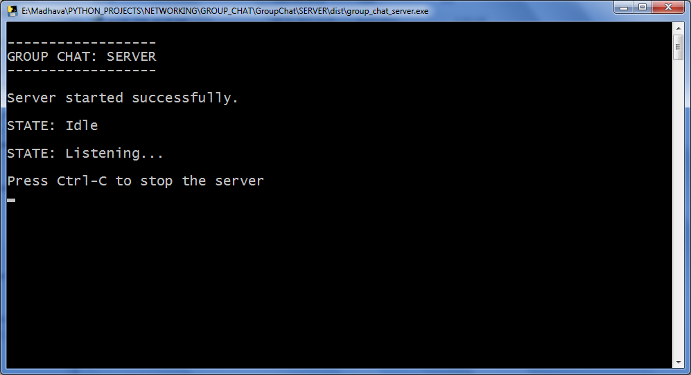
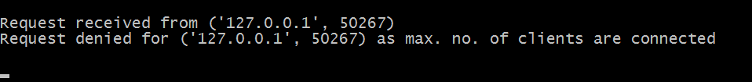
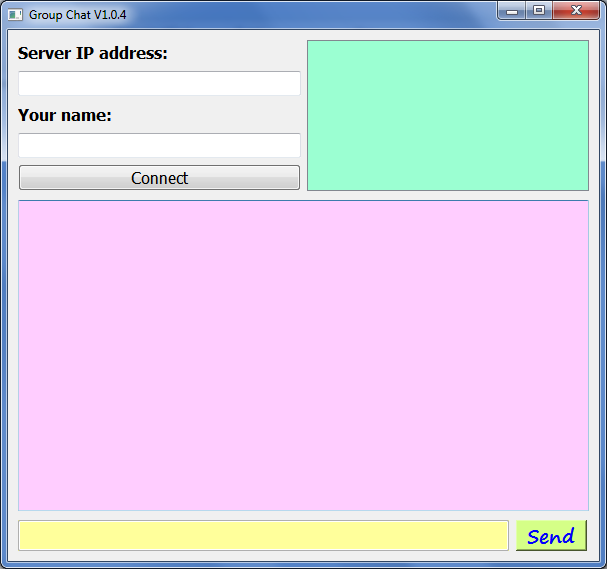
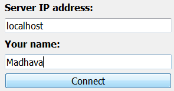
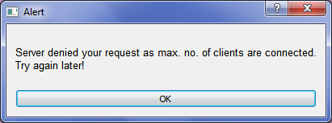
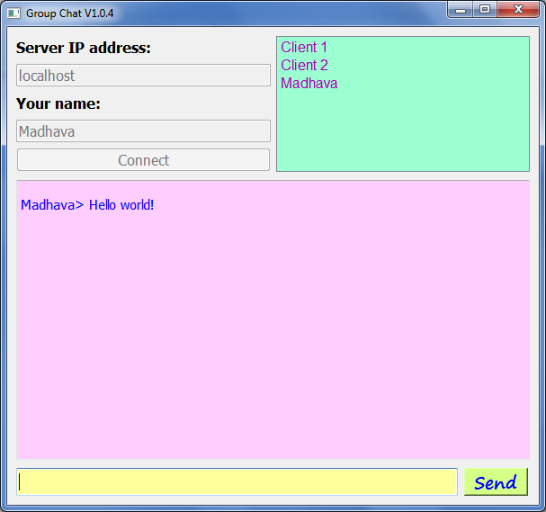
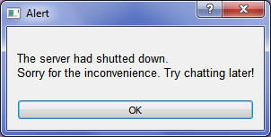
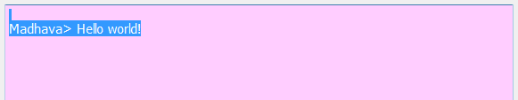

# **GroupChat**

A simple implementation of group chat where the client users can send and receive instant chat messages.

#### :information_source: NOTE: The following build steps must be done for each of the server program and client program separately.

## Build Dependencies

1. #### Python 3.x (3.6 and above suggested)

2. #### PyQt5
    * If you don't have PyQt5 already installed, execute the following command in cmd prompt:

            pip install pyqt5

3. #### pyinstaller
    * If you don't have pyinstaller already installed, execute the following command in cmd prompt:

            pip install pyinstaller

## Build Instructions (for Windows)

1. Double click (run) the *'build.bat'* file. A cmd prompt will open and start building the *exe*.

2. Press *'y'* and *'enter'* key to delete unwanted build files.

3. The *exe* will be created in the *'dist'* folder. Double click (run) the *exe* generated to start the server-side/client-side application.

---

## Application Instructions

### ***Server-side***

1. Once you open the server-side application, the server will automatically go to listening state. All the messages from the server will be displayed in the same window (cmd prompt).

2. If any client connects with the server, the server displays the following message:

3. If the server already have the maximum allowed clients and another client wants to connect, the server displays the following message:

4. When the client disconnects from the server, the server displays the following message:

5. If any error scenario occurs like the client disconnects unexpectedly or the client sends some non-comprehensible message, the server reports it without crashing.

6. To stop the server, press Ctrl-C. Don't worry if some clients are connected at the moment :thumbsup:! They will be cleanly reported that the server had shutted down.

### ***Client-side***

1. First, you must connect with the server. So, give the IP address of the server-side program of this application (where the server runs). If you are running the server in the same computer as the client, then just type 'localhost'. Or else, go to cmd prompt in the computer in which the server is running and give the following command:

        ipconfig

    There, check the IP address of your computer and give it in the client-side window *Entry*.

2. Next, give your name. This name will be showed to the other clients when chatting. Finally, press the *'Connect'* button and you will be connected to the server. If the server already has the maximum number of clients it can handle, then it will deny your request.

3. Once you are connected with the server, you are ready to chat :thumbsup:. The list of clients connected to the server will be displayed in the top left-hand-side green box. You can type your message in the *Entry* in the bottom of the window and press *Enter* key or the *'Send'* button.

    #### :information_source: NOTE: You cannot see what messages that the clients had sent before you had connected with the server (This means that, what you chat now cannot be seen by the clients who join in the future).

    #### :information_source: NOTE: *Colon*'s (':') are not supported in the chat (It will be automatically encoded like this: '{colon}').

4. If the server shuts down when you are connected with it, you will recieve an *Alert* and you will be disconnected.

5. You can copy the messages whenever you want (even after the server had shutted down!) by simply selecting them (or *right-click*) and pressing Ctrl-C.

6. You don't have to worry about any kind of error scenario as, whenever needed, an *Alert* will be raised.

7. To close the client-side application, just simply close the window, and it will take care of informing the server.

